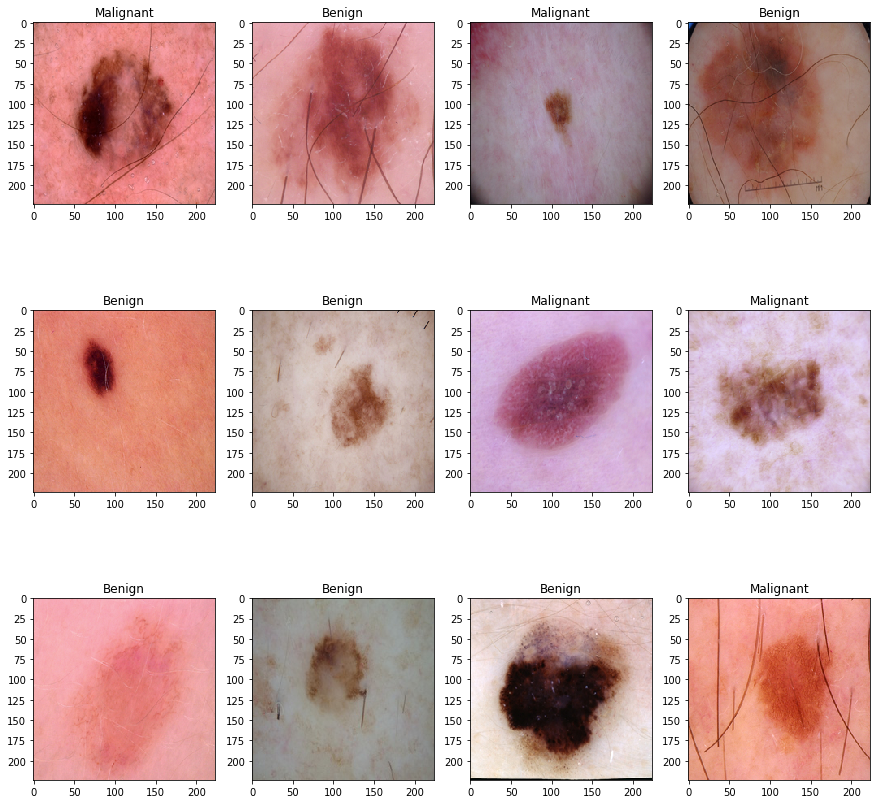
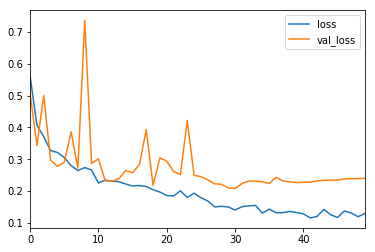
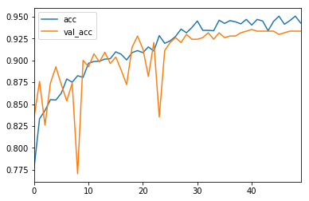
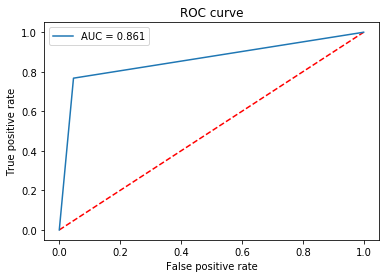
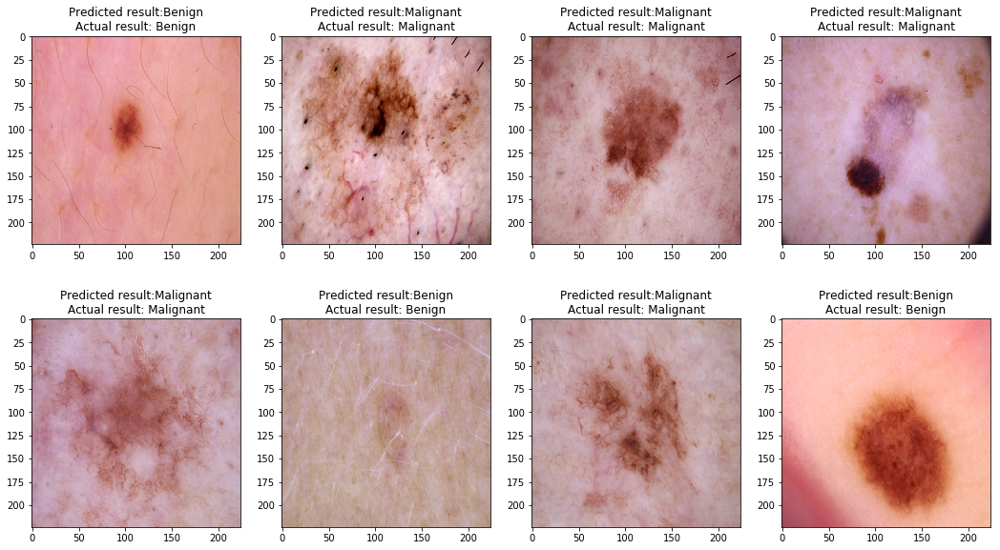
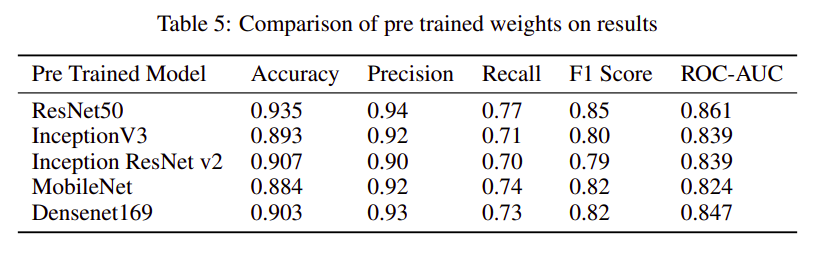
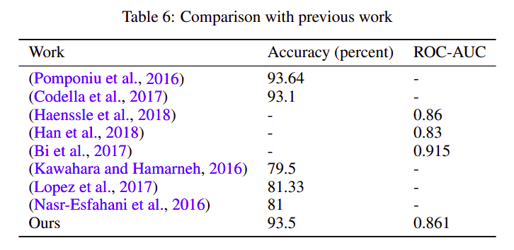

# Skin Cancer Classification
Code for the paper `Convolutional Neural Networks for Classifying Melanoma Images`.

https://abhinavsagar.github.io/files/skin_cnn.pdf

## Abstract

In this work, we address the problem of skin cancer classification using convolutional neural networks. A lot of cancer cases early on are misdiagnosed leading to
severe consequences including the death of patient. Also there are cases in which
patients have other problems and doctors interpret it as skin cancer. This leads to
unnecessary time and money spent for further diagnosis. In this work, we address
both of the above problems using deep neural networks and transfer learning architecture. We have used publicly available ISIC databases for both training and
testing our network. Our model achieves an accuracy of 0.935, precision 0.94,
recall 0.77, F1 score 0.85 and ROC- AUC 0.861 which is better than the previous
state of the art approaches.



## Data

The dataset can be downloaded from [here](https://challenge2018.isic-archive.com/). This is a binary classification problem. I split the data as shown-

```
dataset train
  benign
   b1.jpg
   b2.jpg
   //
  malignant
   m1.jpg
   m2.jpg
   //  validation
   benign
    b1.jpg
    b2.jpg
    //
   malignant
    m1.jpg
    m2.jpg
    //...
```    

## Environment and tools

1. Jupyter Notebook
2. Numpy
3. Pandas
4. Scikit-image
5. Matplotlib
6. Scikit-learn
7. Keras

## Installation

`pip install numpy pandas scikit-image matplotlib scikit-learn keras`

`jupyter notebook`

## Results

### Loss vs Epoch



### Accuracy vs Epoch



### Confusion Matrix


### ROC-AUC curve



### Correct/Incorrect classification samples



### Comparison of pre trained weights on results



### Comparison with previous state of the art



## Citing

If you find this code useful in your research, please consider citing the paper:

BibTex:

```
@article{sagar2020convolutional,
  title={Convolutional Neural Networks for Classifying Melanoma Images},
  author={Sagar, Abhinav},
  journal={bioRxiv},
  year={2020},
  publisher={Cold Spring Harbor Laboratory}
}
```

APA:

`Sagar, A. (2020). Convolutional Neural Networks for Classifying Melanoma Images. bioRxiv.`

## License

```
MIT License

Copyright (c) 2019 Abhinav Sagar

Permission is hereby granted, free of charge, to any person obtaining a copy
of this software and associated documentation files (the "Software"), to deal
in the Software without restriction, including without limitation the rights
to use, copy, modify, merge, publish, distribute, sublicense, and/or sell
copies of the Software, and to permit persons to whom the Software is
furnished to do so, subject to the following conditions:

The above copyright notice and this permission notice shall be included in all
copies or substantial portions of the Software.

THE SOFTWARE IS PROVIDED "AS IS", WITHOUT WARRANTY OF ANY KIND, EXPRESS OR
IMPLIED, INCLUDING BUT NOT LIMITED TO THE WARRANTIES OF MERCHANTABILITY,
FITNESS FOR A PARTICULAR PURPOSE AND NONINFRINGEMENT. IN NO EVENT SHALL THE
AUTHORS OR COPYRIGHT HOLDERS BE LIABLE FOR ANY CLAIM, DAMAGES OR OTHER
LIABILITY, WHETHER IN AN ACTION OF CONTRACT, TORT OR OTHERWISE, ARISING FROM,
OUT OF OR IN CONNECTION WITH THE SOFTWARE OR THE USE OR OTHER DEALINGS IN THE
SOFTWARE.
```
